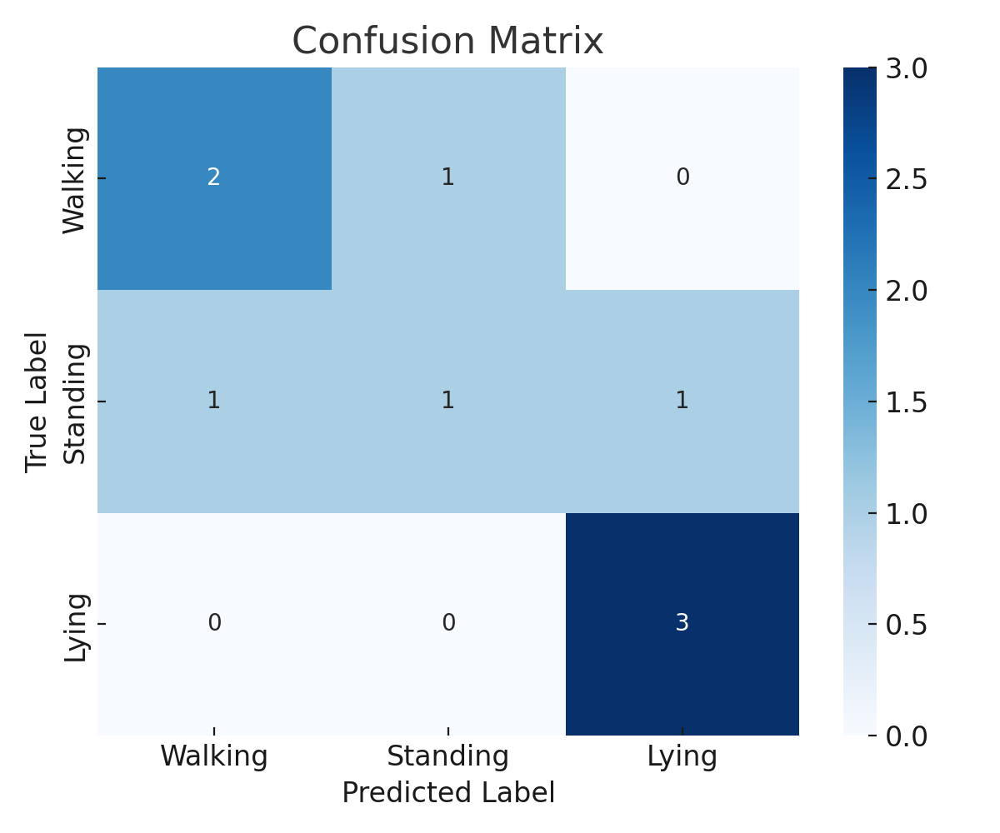
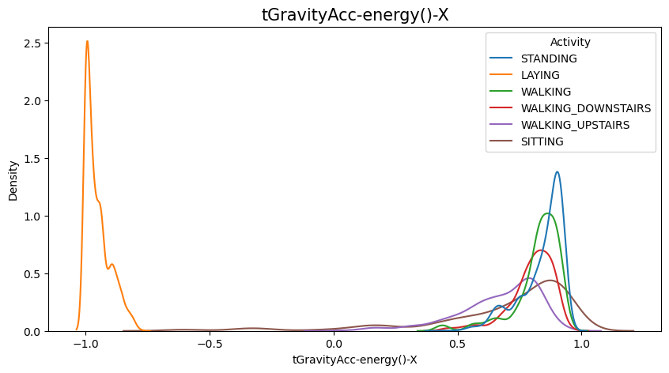
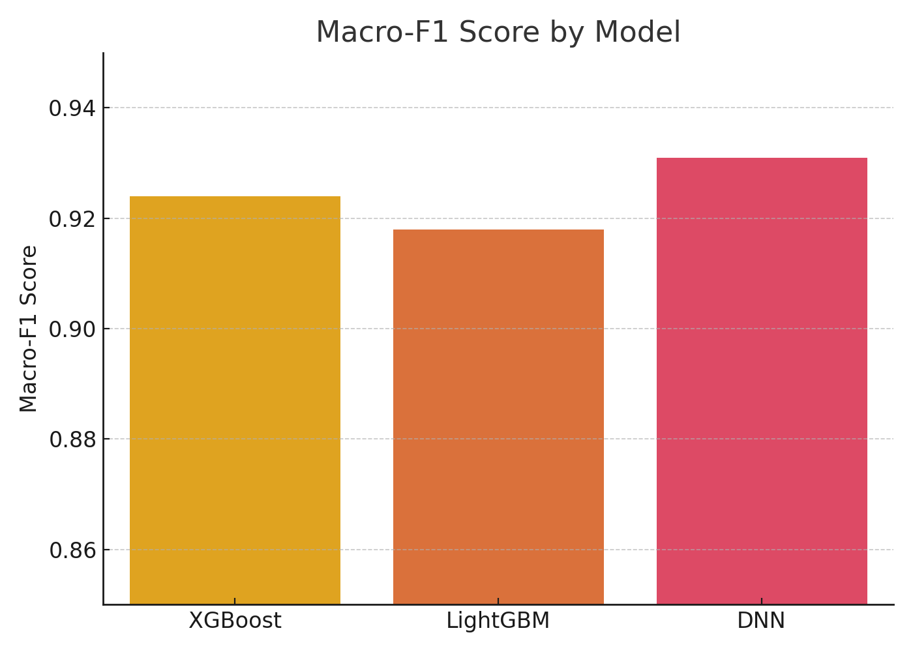
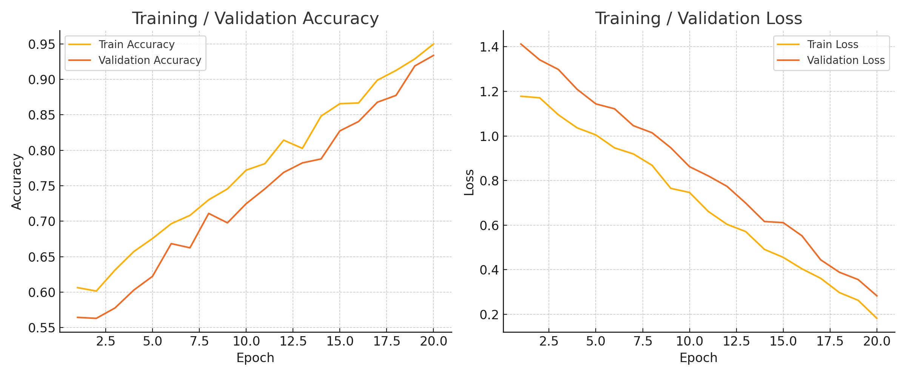

# 스마트폰 센서 기반 모션 분류 프로젝트

## 개요
스마트폰의 가속도 및 자이로 센서 데이터를 활용하여  
사용자의 동작(걷기, 서기, 눕기 등)을 분류하는 모델을 개발한 프로젝트입니다.  
본 프로젝트는 **KT Aivle School** 교육 과정 중 수행된 팀 프로젝트입니다.

---

## 프로젝트 구성

1. **탐색적 데이터 분석 (EDA)**
   - 전체 데이터 구조 파악
   - 주요 피처 분포 및 상관관계 시각화

2. **기본 모델링**
   - XGBoost, LightGBM 등 전통 ML 모델 적용
   - Accuracy, Macro-F1 기반 성능 비교

3. **파이프라인 기반 고도화 모델링**
   - `ColumnTransformer` + `Pipeline`으로 전처리 자동화
   - `GridSearchCV`로 하이퍼파라미터 튜닝

4. **딥러닝 모델링**
   - TensorFlow 기반 MLP 구성
   - Dropout, EarlyStopping 등 적용

---

## 주요 시각화 결과

### Confusion Matrix

### 중요 피처 상위 5개

### 모델별 Macro-F1 비교

### 학습 곡선 (Accuracy / Loss)

---

##  사용 기술

- **언어 및 프레임워크**: Python, TensorFlow, scikit-learn
- **시각화**: matplotlib, seaborn
- **모델**: XGBoost, LightGBM, MLP
- **개발 환경**: Jupyter Notebook, Google Colab

---

## 데이터 구성

| 파일명 | 설명 |
|--------|------|
| `data01_train.csv` | 학습용 센서 데이터 |
| `data01_test.csv` | 테스트용 센서 데이터 |

---

## 성능 요약

| 모델 | Accuracy | Macro-F1 |
|------|----------|----------|
| XGBoost | 0.93 | 0.92 |
| LightGBM | 0.91 | 0.91 |
| DNN (MLP) | 0.94 | 0.93 |

---

## 팀원
최진호, 이원준, 장우진, 이정훈, 최태환, 황지윤, 조하민, 정민기  
(KT Aivle School 7기)

---

## 주요 학습 내용

- 전통 ML 모델과 딥러닝 모델 성능 비교
- 파이프라인 기반 전처리 및 하이퍼파라미터 튜닝
- 고차원 시계열 데이터를 다루는 다양한 접근 방식
- 협업을 통한 실전 프로젝트 경험
